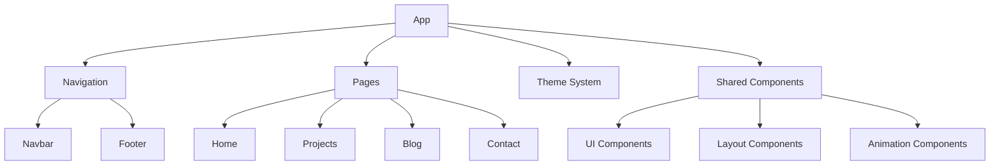

# Portfolio Website Architecture

## High-Level Components Overview



## Component Breakdown & Implementation Status

### 1. Core Infrastructure ⚙️
- [x] Project setup with Vite and TypeScript
- [x] Tailwind CSS configuration
- [x] React Router setup
- [x] Basic component structure
- [ ] Error boundary implementation
- [ ] Loading states and suspense
- [ ] SEO optimization
- [ ] Analytics integration
- [ ] Performance monitoring

### 2. Theme System 🎨
- [x] Dark/Light mode toggle
- [x] Theme context implementation
- [ ] Custom color scheme configuration
- [ ] Theme persistence in localStorage
- [ ] System preference detection
- [ ] Animation transitions between themes
- [ ] Theme variables documentation

### 3. Navigation System 🧭
#### 3.1 Navbar
- [x] Basic responsive layout
- [x] Mobile menu implementation
- [ ] Active link highlighting
- [ ] Scroll behavior
- [ ] Navigation animations
- [ ] Progress indicator for blog posts
- [ ] Search functionality integration

#### 3.2 Footer
- [x] Basic layout and structure
- [x] Social links section
- [ ] Newsletter subscription
- [ ] Dynamic sitemap
- [ ] Copyright information
- [ ] Privacy policy and terms
- [ ] Contact information

### 4. Pages 📄

#### 4.1 Home Page
- [x] Hero section structure
- [ ] Dynamic typing effect
- [ ] Skill showcase
- [ ] Project highlights
- [ ] Testimonials section
- [ ] Call-to-action buttons
- [ ] Animated background
- [ ] Social proof section
- [ ] Latest blog posts preview

#### 4.2 Projects Page
- [x] Basic grid layout
- [x] Project filtering
- [x] Project data structure
- [x] Project filtering logic
- [x] Project card image component
- [ ] Project card content
- [ ] Project detail modal
- [ ] Live preview integration
- [ ] GitHub repository stats
- [ ] Technology tags
- [ ] Project categories
- [ ] Search and filter system
- [ ] Pagination/infinite scroll
- [ ] Project screenshots carousel

#### 4.3 Blog Page
- [x] Blog post list
- [x] Category filtering
- [ ] MDX integration
- [ ] Code syntax highlighting
- [ ] Table of contents
- [ ] Reading time estimation
- [ ] Related posts
- [ ] Author information
- [ ] Comment system
- [ ] Share functionality
- [ ] RSS feed
- [ ] Search functionality
- [ ] Tag cloud
- [ ] Archive by date

#### 4.4 Contact Page
- [x] Contact form structure
- [ ] Form validation
- [ ] Email service integration
- [ ] reCAPTCHA integration
- [ ] Success/error states
- [ ] Auto-response system
- [ ] Contact preferences
- [ ] File attachment support
- [ ] Social media integration

### 5. Shared Components 🧩

#### 5.1 UI Components
- [ ] Button variants
- [ ] Input fields
- [ ] Cards
- [ ] Modals
- [ ] Tooltips
- [ ] Badges
- [ ] Icons
- [ ] Progress bars
- [ ] Alerts
- [ ] Breadcrumbs
- [ ] Pagination
- [ ] Dropdown menus
- [ ] Toggle switches

#### 5.2 Layout Components
- [ ] Container
- [ ] Grid system
- [ ] Flex containers
- [ ] Section dividers
- [ ] Spacing utilities
- [ ] Responsive helpers

#### 5.3 Animation Components
- [ ] Page transitions
- [ ] Scroll animations
- [ ] Hover effects
- [ ] Loading spinners
- [ ] Progress indicators
- [ ] Skeleton loaders

### 6. Data Management 💾
- [ ] Type definitions
- [ ] API integration
- [ ] Data fetching hooks
- [ ] Caching strategy
- [ ] Error handling
- [ ] Loading states
- [ ] Data persistence
- [ ] State management

### 7. Testing 🧪
- [ ] Unit tests setup
- [ ] Component testing
- [ ] Integration tests
- [ ] E2E testing
- [ ] Accessibility testing
- [ ] Performance testing
- [ ] SEO testing
- [ ] Cross-browser testing

### 8. Deployment & CI/CD 🚀
- [ ] GitHub Actions setup
- [ ] Automated testing
- [ ] Build optimization
- [ ] Environment configuration
- [ ] Deployment scripts
- [ ] SSL configuration
- [ ] CDN setup
- [ ] Monitoring and alerts

### 9. Documentation 📚
- [x] Project README
- [x] Architecture overview
- [ ] Component documentation
- [ ] API documentation
- [ ] Style guide
- [ ] Contributing guidelines
- [ ] Security policy
- [ ] License information

### 10. Performance Optimization 🏃
- [ ] Image optimization
- [ ] Code splitting
- [ ] Bundle size analysis
- [ ] Lazy loading
- [ ] Caching strategy
- [ ] Resource preloading
- [ ] Performance monitoring
- [ ] Lighthouse score optimization

### 11. Accessibility 👥
- [ ] ARIA labels
- [ ] Keyboard navigation
- [ ] Screen reader support
- [ ] Color contrast
- [ ] Focus management
- [ ] Alt text
- [ ] Skip links
- [ ] Semantic HTML

## Implementation Priority

1. Core Infrastructure (Essential features)
2. Navigation System (Basic user flow)
3. Home Page (First impression)
4. Projects Page (Portfolio showcase)
5. Contact Page (User engagement)
6. Blog Page (Content sharing)
7. Shared Components (UI consistency)
8. Testing & Documentation
9. Performance Optimization
10. Accessibility
11. Deployment & CI/CD

## Development Workflow

1. Feature Branch Creation
```bash
git checkout -b feature/component-name
```

2. Development
- Implement component logic
- Add styles
- Write tests
- Update documentation

3. Testing
```bash
npm run test
npm run lint
```

4. Code Review
- Create pull request
- Address feedback
- Update changes

5. Merge
```bash
git checkout main
git pull origin main
git merge feature/component-name
git push origin main
```

## Getting Started with Development

1. Clone the repository
```bash
git clone https://github.com/tophbuddy/portfolio-website.git
cd portfolio-website
```

2. Install dependencies
```bash
npm install
```

3. Start development server
```bash
npm run dev
```

4. Build for production
```bash
npm run build
```

## Contribution Guidelines

1. Follow the existing code style
2. Write meaningful commit messages
3. Update documentation as needed
4. Add tests for new features
5. Ensure all tests pass before submitting PR
6. Keep PRs focused and atomic

## Resources

- [React Documentation](https://react.dev)
- [TypeScript Documentation](https://www.typescriptlang.org/docs)
- [Tailwind CSS Documentation](https://tailwindcss.com/docs)
- [Vite Documentation](https://vitejs.dev/guide)
- [Framer Motion Documentation](https://www.framer.com/motion)
