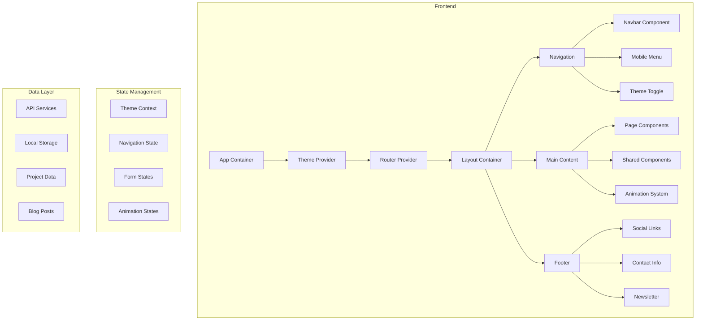
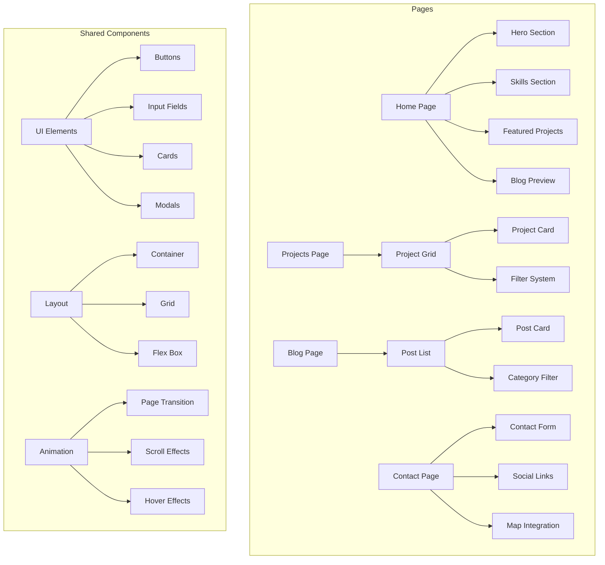
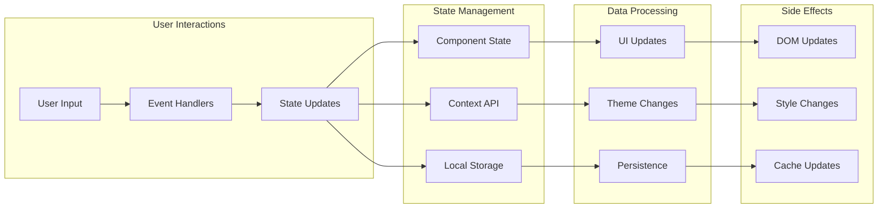
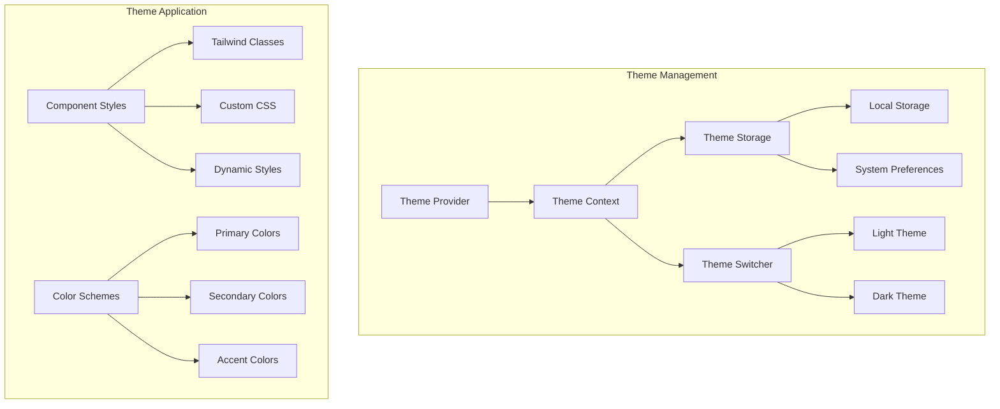
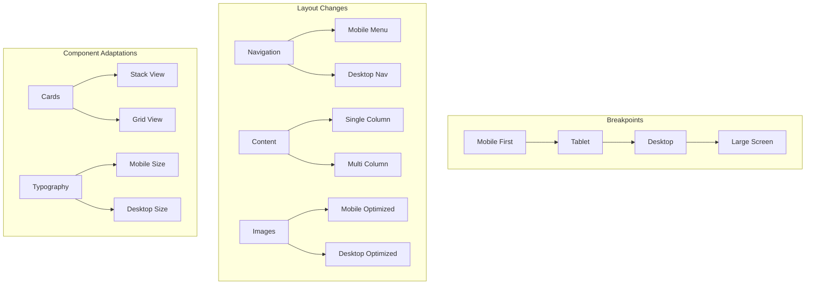
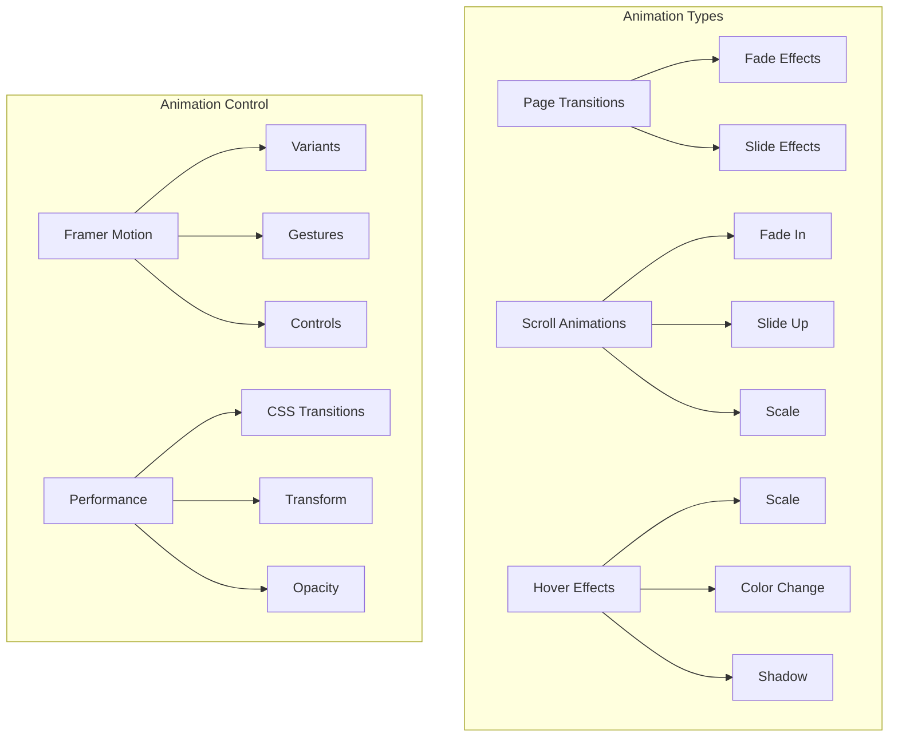
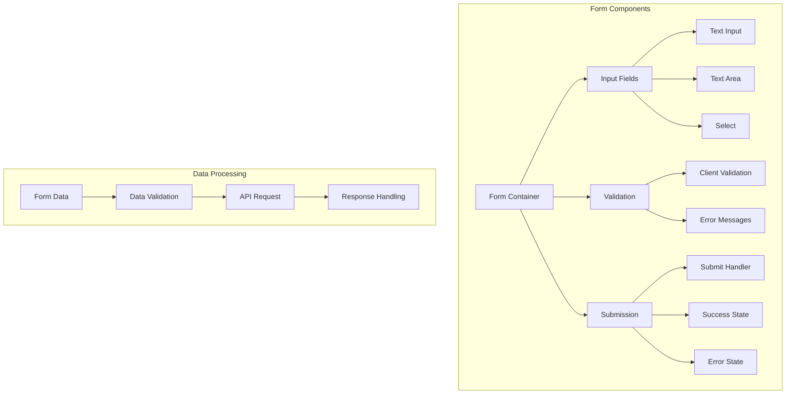
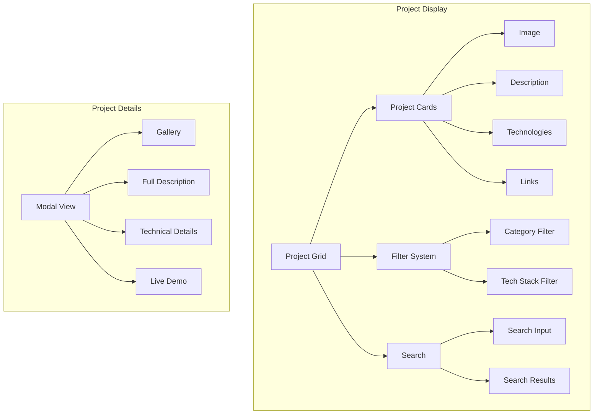
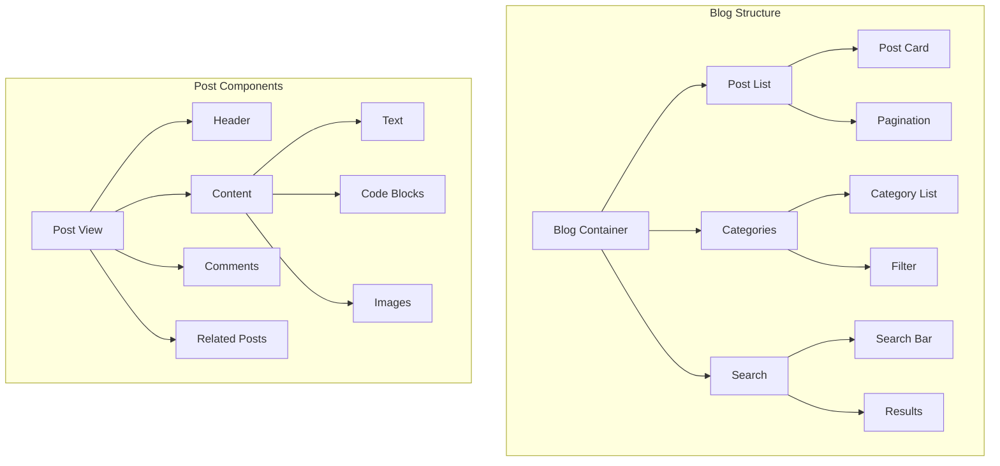
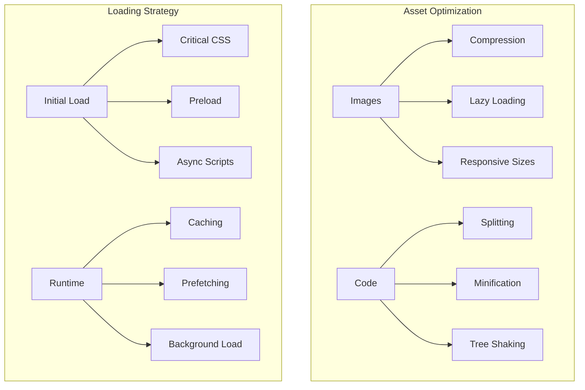

# Detailed Architecture Diagrams

## 1. Overall Application Architecture

## 2. Component Hierarchy

## 3. Data Flow Architecture

## 4. Theme System Architecture

## 5. Responsive Design System

## 6. Animation System

## 7. Form Handling System

## 8. Project Showcase System

## 9. Blog System

## 10. Performance Optimization System

These diagrams provide a comprehensive view of the website's architecture from different perspectives. Each diagram focuses on a specific aspect of the system, making it easier to understand and implement the various components and their interactions.

The diagrams are designed to be modular, allowing you to implement features incrementally while maintaining a clear understanding of how each part fits into the larger system.

Would you like me to explain any specific diagram in more detail or create additional diagrams for other aspects of the system?
